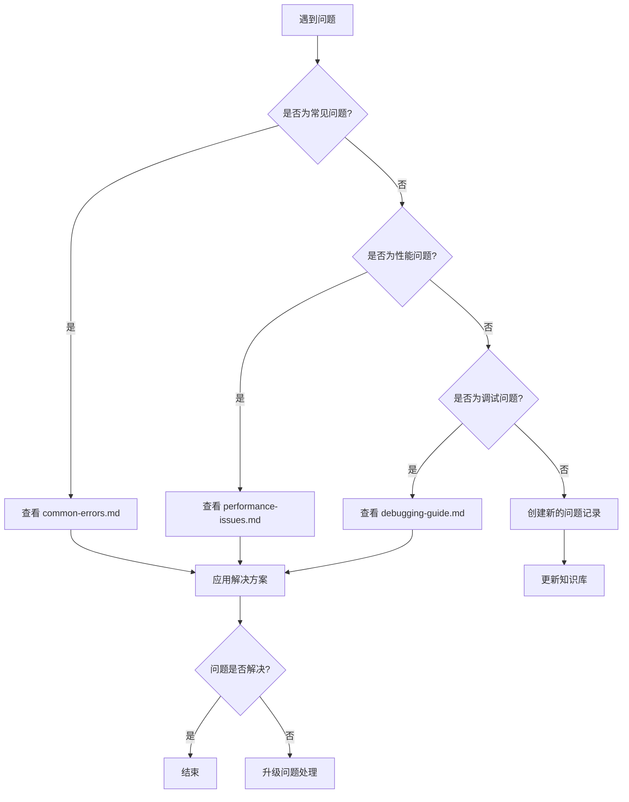

# 项目知识库管理系统

## 📚 知识库结构

```
knowledge-base/
├── README.md                    # 知识库总览
├── troubleshooting/            # 问题排查指南
│   ├── common-errors.md        # 常见错误解决方案
│   ├── debugging-guide.md      # 调试指南
│   └── performance-issues.md   # 性能问题排查
├── best-practices/             # 最佳实践
│   ├── code-standards.md       # 代码规范
│   ├── security-guidelines.md  # 安全指南
│   └── testing-strategies.md   # 测试策略
├── architecture/               # 架构文档
│   ├── system-design.md        # 系统设计
│   ├── database-schema.md      # 数据库设计
│   └── api-documentation.md    # API 文档
├── workflows/                  # 工作流程
│   ├── development-process.md  # 开发流程
│   ├── code-review-guide.md    # 代码审查指南
│   └── deployment-process.md   # 部署流程
└── templates/                  # 模板文件
    ├── component-template.tsx  # 组件模板
    ├── api-template.ts         # API 模板
    └── test-template.spec.ts   # 测试模板
```

## 🎯 知识库使用指南

### 1. 问题查找流程



### 2. 知识贡献流程

#### 添加新知识
1. 确定知识分类
2. 选择合适的文档位置
3. 使用标准模板
4. 添加标签和索引
5. 提交 Pull Request

#### 更新现有知识
1. 找到相关文档
2. 验证信息准确性
3. 更新内容和时间戳
4. 添加变更说明

### 3. 文档编写规范

#### 标题规范
```markdown
# 一级标题：文档主题
## 二级标题：主要章节
### 三级标题：具体内容
#### 四级标题：详细说明
```

#### 代码块规范
```markdown
```typescript:文件路径
// 代码内容
```
```

#### 问题记录格式
```markdown
## 问题描述
**问题类型**: [错误/警告/性能/其他]
**发生时间**: YYYY-MM-DD
**影响范围**: [前端/后端/数据库/部署]
**严重程度**: [低/中/高/紧急]

### 问题现象
详细描述问题的表现...

### 错误信息
```
具体的错误日志或信息
```

### 解决方案
1. 步骤一
2. 步骤二
3. 步骤三

### 根本原因
分析问题的根本原因...

### 预防措施
如何避免类似问题再次发生...

### 相关链接
- [相关文档](链接)
- [参考资料](链接)
```

## 🔍 快速索引

### 按问题类型索引

#### 🚨 紧急问题
- [服务器宕机处理](troubleshooting/server-down.md)
- [数据库连接失败](troubleshooting/database-connection.md)
- [构建失败](troubleshooting/build-failures.md)

#### ⚠️ 常见错误
- [图标导入错误](troubleshooting/icon-import-errors.md)
- [TypeScript 类型错误](troubleshooting/typescript-errors.md)
- [API 调用失败](troubleshooting/api-errors.md)
- [权限验证问题](troubleshooting/auth-errors.md)

#### 🐛 调试技巧
- [前端调试指南](troubleshooting/frontend-debugging.md)
- [后端调试指南](troubleshooting/backend-debugging.md)
- [数据库调试](troubleshooting/database-debugging.md)

#### 🚀 性能优化
- [前端性能优化](best-practices/frontend-performance.md)
- [后端性能优化](best-practices/backend-performance.md)
- [数据库性能优化](best-practices/database-performance.md)

### 按技术栈索引

#### 前端技术
- [React 最佳实践](best-practices/react-best-practices.md)
- [TypeScript 使用指南](best-practices/typescript-guide.md)
- [Ant Design 使用规范](../component-library-guidelines.md)
- [Vite 配置优化](best-practices/vite-optimization.md)

#### 后端技术
- [Node.js 最佳实践](best-practices/nodejs-best-practices.md)
- [Express 框架指南](best-practices/express-guide.md)
- [Prisma ORM 使用](best-practices/prisma-guide.md)
- [API 设计规范](best-practices/api-design.md)

#### 数据库
- [PostgreSQL 优化](best-practices/postgresql-optimization.md)
- [数据库设计原则](architecture/database-design-principles.md)
- [迁移管理](workflows/database-migration.md)

#### 部署运维
- [Docker 容器化](best-practices/docker-guide.md)
- [CI/CD 流水线](workflows/cicd-pipeline.md)
- [监控告警](best-practices/monitoring-guide.md)

## 📊 知识库统计

### 文档更新频率
- 每周更新：troubleshooting/
- 每月更新：best-practices/
- 每季度更新：architecture/
- 按需更新：workflows/, templates/

### 贡献者统计
| 贡献者 | 文档数量 | 最后更新 |
|--------|----------|----------|
| 开发团队 | 25 | 2024-01-15 |
| 测试团队 | 8 | 2024-01-10 |
| 运维团队 | 12 | 2024-01-12 |

## 🔧 知识库维护

### 定期维护任务

#### 每周任务
- [ ] 检查新增问题记录
- [ ] 更新常见错误解决方案
- [ ] 验证链接有效性

#### 每月任务
- [ ] 审查文档准确性
- [ ] 更新技术栈版本信息
- [ ] 整理重复内容

#### 每季度任务
- [ ] 重构文档结构
- [ ] 更新架构文档
- [ ] 评估知识库使用效果

### 质量控制

#### 文档质量标准
1. **准确性**: 信息必须准确无误
2. **时效性**: 定期更新，标注更新时间
3. **完整性**: 包含问题、解决方案、预防措施
4. **可读性**: 结构清晰，语言简洁
5. **可操作性**: 提供具体的操作步骤

#### 审核流程
1. 内容创建者自检
2. 同行评审
3. 技术负责人审批
4. 定期质量审计

## 📱 知识库工具

### 搜索工具
```bash
# 全文搜索脚本
#!/bin/bash
grep -r "$1" docs/knowledge-base/ --include="*.md"
```

### 文档生成工具
```bash
# 生成文档索引
npm run docs:index

# 生成 PDF 文档
npm run docs:pdf

# 检查链接有效性
npm run docs:check-links
```

### 统计工具
```bash
# 统计文档数量
find docs/knowledge-base -name "*.md" | wc -l

# 统计代码示例数量
grep -r "```" docs/knowledge-base/ | wc -l
```

## 🎯 使用建议

### 对于开发者
1. 遇到问题先查知识库
2. 解决问题后及时更新文档
3. 定期浏览最佳实践
4. 参与文档审核

### 对于团队负责人
1. 定期检查知识库使用情况
2. 推动团队贡献知识
3. 确保文档质量
4. 制定知识管理策略

### 对于新成员
1. 从架构文档开始了解项目
2. 学习开发流程和规范
3. 熟悉常见问题解决方案
4. 积极参与知识贡献

---

**最后更新**: 2024-01-15  
**维护者**: 开发团队  
**版本**: v1.0.0