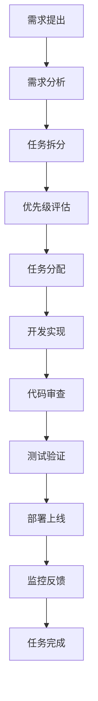

# 项目管理与工作流程

## 🎯 项目管理原则

### 敏捷开发方法
- **迭代开发**: 2周一个迭代周期
- **持续集成**: 每次提交都触发自动化测试
- **持续部署**: 通过测试的代码自动部署到测试环境
- **快速反馈**: 及时收集用户反馈并调整

### 团队协作原则
- **透明沟通**: 所有决策和进展公开透明
- **责任明确**: 每个任务都有明确的负责人
- **知识共享**: 定期进行技术分享和代码审查
- **持续学习**: 鼓励团队成员学习新技术

---

## 📋 任务管理流程

### 任务生命周期



### 任务状态定义

| 状态 | 描述 | 负责人 | 下一步 |
|------|------|--------|--------|
| **待办** | 任务已创建，等待开始 | 产品经理 | 分配给开发者 |
| **进行中** | 正在开发实现 | 开发者 | 提交代码审查 |
| **代码审查** | 等待同事审查代码 | 审查者 | 通过或要求修改 |
| **测试中** | 功能测试和集成测试 | 测试工程师 | 通过或报告 Bug |
| **待部署** | 准备部署到生产环境 | DevOps | 部署上线 |
| **已完成** | 任务完成并上线 | 产品经理 | 监控和反馈 |
| **已取消** | 任务被取消或废弃 | 产品经理 | 归档 |

### 任务优先级

#### P0 - 紧急且重要
- 生产环境故障
- 安全漏洞修复
- 关键功能 Bug
- **处理时间**: 立即处理
- **响应时间**: 1小时内

#### P1 - 重要但不紧急
- 新功能开发
- 性能优化
- 用户体验改进
- **处理时间**: 当前迭代
- **响应时间**: 1天内

#### P2 - 紧急但不重要
- 小的 UI 调整
- 文档更新
- 代码重构
- **处理时间**: 下个迭代
- **响应时间**: 3天内

#### P3 - 既不紧急也不重要
- 技术债务清理
- 工具改进
- 探索性任务
- **处理时间**: 有空闲时间时
- **响应时间**: 1周内

---

## 🔄 Git 工作流程

### 分支策略 (Git Flow)

```
master (生产环境)
├── develop (开发环境)
│   ├── feature/user-authentication
│   ├── feature/data-visualization
│   └── feature/api-optimization
├── release/v1.2.0 (预发布)
└── hotfix/critical-bug-fix (紧急修复)
```

### 分支命名规范

```bash
# 功能分支
feature/功能名称
feature/user-login
feature/data-export
feature/payment-integration

# 修复分支
bugfix/问题描述
bugfix/login-error
bugfix/memory-leak

# 热修复分支
hotfix/紧急问题
hotfix/security-patch
hotfix/critical-crash

# 发布分支
release/版本号
release/v1.2.0
release/v2.0.0-beta
```

### 提交信息规范

```bash
# 格式: <类型>(<范围>): <描述>

# 功能开发
feat(auth): 添加用户登录功能
feat(api): 实现数据导出接口
feat(ui): 添加数据可视化组件

# Bug 修复
fix(login): 修复登录状态丢失问题
fix(api): 解决数据查询超时问题
fix(ui): 修复移动端样式错误

# 文档更新
docs(readme): 更新安装说明
docs(api): 添加接口文档

# 代码重构
refactor(auth): 重构用户认证逻辑
refactor(db): 优化数据库查询性能

# 测试相关
test(user): 添加用户服务单元测试
test(api): 完善 API 集成测试

# 构建和工具
build(deps): 升级依赖包版本
ci(github): 更新 GitHub Actions 配置
```

### 代码审查流程

#### 1. 提交 Pull Request
```markdown
## 变更描述
简要描述本次变更的内容和目的

## 变更类型
- [ ] 新功能
- [ ] Bug 修复
- [ ] 代码重构
- [ ] 文档更新
- [ ] 性能优化

## 测试情况
- [ ] 单元测试通过
- [ ] 集成测试通过
- [ ] 手动测试完成

## 相关问题
关联的 Issue 或任务编号

## 截图或演示
如果有 UI 变更，请提供截图或 GIF

## 检查清单
- [ ] 代码符合规范
- [ ] 添加了必要的测试
- [ ] 更新了相关文档
- [ ] 没有引入新的安全风险
```

#### 2. 审查要点
- **功能正确性**: 代码是否实现了预期功能
- **代码质量**: 是否遵循编码规范
- **性能影响**: 是否有性能问题
- **安全性**: 是否存在安全漏洞
- **可维护性**: 代码是否易于理解和维护
- **测试覆盖**: 是否有足够的测试

#### 3. 审查结果
- **批准 (Approve)**: 代码质量良好，可以合并
- **请求修改 (Request Changes)**: 需要修改后再次审查
- **评论 (Comment)**: 提供建议但不阻止合并

---

## 🚀 发布流程

### 版本号规范 (Semantic Versioning)

```
主版本号.次版本号.修订号
MAJOR.MINOR.PATCH

例如: 1.2.3
```

- **主版本号 (MAJOR)**: 不兼容的 API 修改
- **次版本号 (MINOR)**: 向下兼容的功能性新增
- **修订号 (PATCH)**: 向下兼容的问题修正

### 发布检查清单

#### 发布前检查
- [ ] 所有功能测试通过
- [ ] 性能测试通过
- [ ] 安全扫描通过
- [ ] 文档更新完成
- [ ] 变更日志更新
- [ ] 数据库迁移脚本准备
- [ ] 回滚方案准备

#### 发布步骤
1. **创建发布分支**
   ```bash
   git checkout develop
   git pull origin develop
   git checkout -b release/v1.2.0
   ```

2. **更新版本信息**
   ```bash
   # 更新 package.json 版本号
   npm version 1.2.0
   
   # 更新 CHANGELOG.md
   echo "## [1.2.0] - $(date +%Y-%m-%d)" >> CHANGELOG.md
   ```

3. **最终测试**
   ```bash
   npm run test
   npm run build
   npm run test:e2e
   ```

4. **合并到主分支**
   ```bash
   git checkout master
   git merge release/v1.2.0
   git tag v1.2.0
   git push origin master --tags
   ```

5. **部署到生产环境**
   ```bash
   # 自动化部署
   npm run deploy:production
   
   # 或手动部署
   docker build -t app:v1.2.0 .
   docker push registry/app:v1.2.0
   kubectl set image deployment/app app=registry/app:v1.2.0
   ```

#### 发布后检查
- [ ] 生产环境功能正常
- [ ] 监控指标正常
- [ ] 用户反馈收集
- [ ] 性能指标监控
- [ ] 错误日志检查

---

## 📊 项目监控

### 关键指标 (KPI)

#### 开发效率指标
- **代码提交频率**: 每天平均提交次数
- **功能交付速度**: 每个迭代完成的功能点数
- **Bug 修复时间**: 从发现到修复的平均时间
- **代码审查时间**: 从提交到审查完成的时间

#### 质量指标
- **Bug 密度**: 每千行代码的 Bug 数量
- **测试覆盖率**: 单元测试和集成测试覆盖率
- **代码重复率**: 重复代码的百分比
- **技术债务**: 需要重构的代码量

#### 用户体验指标
- **页面加载时间**: 平均页面加载速度
- **API 响应时间**: 接口平均响应时间
- **错误率**: 用户操作失败率
- **用户满意度**: 用户反馈评分

### 监控工具配置

#### 1. 应用性能监控 (APM)
```javascript
// 前端监控 - Sentry
import * as Sentry from '@sentry/react';

Sentry.init({
  dsn: process.env.REACT_APP_SENTRY_DSN,
  environment: process.env.NODE_ENV,
  tracesSampleRate: 1.0,
});

// 后端监控 - New Relic
const newrelic = require('newrelic');

app.use((req, res, next) => {
  newrelic.addCustomAttribute('userId', req.user?.id);
  newrelic.addCustomAttribute('userRole', req.user?.role);
  next();
});
```

#### 2. 日志监控
```javascript
// Winston 日志配置
const winston = require('winston');

const logger = winston.createLogger({
  level: 'info',
  format: winston.format.combine(
    winston.format.timestamp(),
    winston.format.errors({ stack: true }),
    winston.format.json()
  ),
  transports: [
    new winston.transports.File({ filename: 'error.log', level: 'error' }),
    new winston.transports.File({ filename: 'combined.log' }),
    new winston.transports.Console({
      format: winston.format.simple()
    })
  ]
});
```

#### 3. 业务指标监控
```javascript
// Prometheus 指标收集
const prometheus = require('prom-client');

// 创建指标
const httpRequestDuration = new prometheus.Histogram({
  name: 'http_request_duration_seconds',
  help: 'Duration of HTTP requests in seconds',
  labelNames: ['method', 'route', 'status']
});

const activeUsers = new prometheus.Gauge({
  name: 'active_users_total',
  help: 'Number of active users'
});

// 中间件记录指标
app.use((req, res, next) => {
  const start = Date.now();
  
  res.on('finish', () => {
    const duration = (Date.now() - start) / 1000;
    httpRequestDuration
      .labels(req.method, req.route?.path || req.path, res.statusCode)
      .observe(duration);
  });
  
  next();
});
```

---

## 🔧 工具和自动化

### 开发工具链

#### 1. 代码质量工具
```json
{
  "scripts": {
    "lint": "eslint src --ext .ts,.tsx --fix",
    "type-check": "tsc --noEmit",
    "format": "prettier --write src/**/*.{ts,tsx,css,md}",
    "audit": "npm audit --audit-level moderate",
    "security": "snyk test"
  }
}
```

#### 2. 自动化测试
```yaml
# GitHub Actions 配置
name: CI/CD Pipeline

on:
  push:
    branches: [ main, develop ]
  pull_request:
    branches: [ main ]

jobs:
  test:
    runs-on: ubuntu-latest
    steps:
      - uses: actions/checkout@v3
      - uses: actions/setup-node@v3
        with:
          node-version: '18'
          cache: 'npm'
      
      - run: npm ci
      - run: npm run lint
      - run: npm run type-check
      - run: npm run test:unit
      - run: npm run test:e2e
      - run: npm run build
      
      - name: Upload coverage
        uses: codecov/codecov-action@v3
```

#### 3. 部署自动化
```dockerfile
# Dockerfile
FROM node:18-alpine AS builder
WORKDIR /app
COPY package*.json ./
RUN npm ci --only=production

FROM node:18-alpine AS runtime
WORKDIR /app
COPY --from=builder /app/node_modules ./node_modules
COPY . .
EXPOSE 3000
CMD ["npm", "start"]
```

```yaml
# Kubernetes 部署配置
apiVersion: apps/v1
kind: Deployment
metadata:
  name: app-deployment
spec:
  replicas: 3
  selector:
    matchLabels:
      app: myapp
  template:
    metadata:
      labels:
        app: myapp
    spec:
      containers:
      - name: app
        image: myapp:latest
        ports:
        - containerPort: 3000
        env:
        - name: NODE_ENV
          value: "production"
        resources:
          requests:
            memory: "256Mi"
            cpu: "250m"
          limits:
            memory: "512Mi"
            cpu: "500m"
```

---

## 📈 持续改进

### 回顾会议 (Retrospective)

#### 会议频率
- **迭代回顾**: 每个迭代结束后
- **月度回顾**: 每月最后一周
- **季度回顾**: 每季度末

#### 回顾内容
1. **做得好的地方** (Keep)
   - 哪些实践效果很好？
   - 哪些工具提高了效率？
   - 团队协作有哪些亮点？

2. **需要改进的地方** (Improve)
   - 遇到了哪些问题？
   - 哪些流程可以优化？
   - 工具使用有什么困难？

3. **尝试新的做法** (Try)
   - 有什么新的想法？
   - 可以引入哪些新工具？
   - 如何提高团队效率？

### 改进行动计划

#### 短期改进 (1-2周)
- 修复明显的流程问题
- 更新工具配置
- 优化开发环境

#### 中期改进 (1-2个月)
- 引入新的开发工具
- 完善自动化流程
- 提升代码质量标准

#### 长期改进 (3-6个月)
- 架构优化
- 技术栈升级
- 团队技能提升

### 知识管理

#### 文档维护
- **定期更新**: 每月检查文档的准确性
- **版本控制**: 使用 Git 管理文档变更
- **协作编辑**: 鼓励团队成员贡献文档

#### 经验分享
- **技术分享会**: 每周五下午技术分享
- **代码审查**: 通过审查传播最佳实践
- **问题总结**: 将解决的问题记录到知识库

---

## 📋 检查清单

### 项目启动检查清单
- [ ] 项目目标明确
- [ ] 技术栈选择合理
- [ ] 团队角色分工明确
- [ ] 开发环境搭建完成
- [ ] 代码仓库创建
- [ ] CI/CD 流水线配置
- [ ] 监控系统部署
- [ ] 文档结构建立

### 迭代开发检查清单
- [ ] 需求分析完成
- [ ] 任务拆分合理
- [ ] 优先级排序
- [ ] 开发计划制定
- [ ] 代码审查流程
- [ ] 测试计划执行
- [ ] 部署方案准备
- [ ] 监控指标设置

### 发布前检查清单
- [ ] 功能测试通过
- [ ] 性能测试通过
- [ ] 安全检查通过
- [ ] 文档更新完成
- [ ] 回滚方案准备
- [ ] 监控告警配置
- [ ] 团队通知发送
- [ ] 用户通知准备

---

**最后更新**: 2024-01-15  
**维护者**: 项目管理团队  
**相关文档**: [代码规范](../best-practices/code-standards.md), [环境配置](../environment-setup.md)